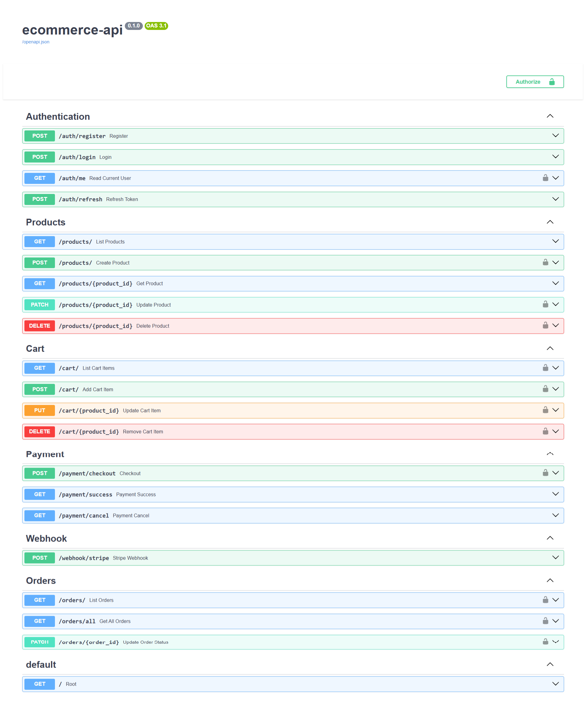

# Ecommerce API (FastAPI + Stripe)

A **RESTful e-commerce backend** built with **FastAPI**, featuring a **production-style layered architecture**, **JWT authentication**, **cart & checkout system**, and **Stripe payment integration with webhooks**.

This project demonstrates **real-world backend patterns** and is continuously evolving towards **production-ready quality**.

## Features

### Current MVP
- **Authentication & Users**
  - User registration & login with JWT
  - Fetch current logged-in user info
- **Products**
  - Admin CRUD for products (add, update, delete)
  - Public product listing and product details
- **Cart & Checkout**
  - Add, update, and remove cart items
  - Checkout endpoint to place orders
- **Orders**
  - View user orders
  - Admin can view all orders and update order status
- **Stripe Payment Integration**
  - Create Stripe checkout sessions
  - Handle Stripe webhooks for payment confirmation
  - Update order status after successful payment


## Project Structure

```bash
ecommerce-api/
├── app/
│   ├── main.py                 # FastAPI entry point
│   │
│   ├── api/                    # API route handlers
│   │   ├── auth.py
│   │   ├── product.py
│   │   ├── cart.py
│   │   ├── order.py
│   │   ├── payment.py          # Stripe checkout endpoints
│   │   └── webhook.py          # Stripe webhook handling
│   │
│   ├── core/                   # Core configuration & security
│   │   ├── dependencies.py
│   │   ├── settings.py
│   │   └── security.py
│   │
│   ├── db/                     # Database initialization & dependencies
│   │   ├── deps.py
│   │   ├── init_db.py
│   │   └── __init__.py
│   │
│   ├── models/                 # SQLAlchemy models
│   │   ├── user.py
│   │   ├── product.py
│   │   ├── cart_item.py
│   │   └── order.py
│   │
│   ├── repositories/           # Database queries (CRUD operations)
│   │   ├── user.py
│   │   ├── product.py
│   │   ├── cart.py
│   │   └── order.py
│   │
│   ├── schemas/                # Pydantic schemas for validation
│   │   ├── user.py
│   │   ├── product.py
│   │   ├── cart_item.py
│   │   ├── order.py
│   │   └── token.py
│   │
│   ├── services/               # Business logic
│   │   ├── user.py
│   │   ├── product.py
│   │   ├── cart.py
│   │   ├── order.py
│   │   └── payment.py          # Stripe session & webhook logic
│   │
│   └── utils/                  # Helper functions & utilities
│       ├── auth.py
│       └── exceptions.py
│
├── requirements.txt            # Project dependencies
├── .gitignore                  # Ignored files for Git
└── README.md                   # Project documentation
```

## Installation & Setup

1. Clone the repository

```bash
git clone https://github.com/pdmg-dev/ecommerce-api.git
cd ecommerce-api
```

2. Create and activate a virtual environment

```bash
python -m venv venv

source venv/bin/activate      # Mac/Linux
venv\Scripts\activate         # Windows
```

3. Install dependencies

```bash
pip install -r requirements.txt
```

4. Set up environment variables

Create a .env file (example):

```bash
DATABASE_URL=sqlite:///./test.db

# JWT
SECRET_KEY=your-secret-key
ALGORITHM=HS256
ACCESS_TOKEN_EXPIRE_MINUTES=30

# Stripe
STRIPE_SECRET_KEY=sk_test_xxx
STRIPE_PUBLIC_KEY=pk_test_xxx
STRIPE_WEBHOOK_SECRET=whsec_xxx
```

5. Run the application

```bash
uvicorn app.main:app --reload
```

Access the interactive docs:
- Swagger UI → http://127.0.0.1:8000/docs
- ReDoc → http://127.0.0.1:8000/redoc

## API Endpoints

**Auth**
- `POST /auth/register` – Register a new user
- `POST /auth/login` – Login and receive JWT
- `GET /auth/me` – Get current logged-in user info
- `GET /auth/refresh` – Automatic refresh of tokens

**Products**
- `GET /products/` – View all available products
- `POST /products/` – Add product (Admin)
- `GET /products/{id}` – View product details
- `PATCH /products/{produc_id}` – Update product (Admin)
- `DELETE /products/{id}` – Delete product (Admin)

**Cart**
- `GET /cart/` – View current user cart
- `POST /cart/` – Add item to cart
- `PUT /cart/{product_id}` – Update cart item quantity
- `DELETE /cart/{product_id}` – Remove item from cart

**Payments (Stripe)**
- `POST /payment/checkout` – Create Stripe checkout session
- `GET /payment/success` – Successfull payment
- `GET /payment/cancel` – Cancelled pyment

**Webhook**
- `POST /webhook/stripe` – Handle Stripe webhook events (payment confirmation)

**Orders**
- `GET /orders` – View current user orders
- `GET /orders/all` – View all orders (Admin)
- `PATCH /orders/{id}` – Update order status (Admin)



## Testing

A complete **Postman collection** is included to quickly test all endpoints:

1. Import the collection from: `postman/ecommerce-api.postman_collection.json`

2.  Start the server:
```bash
uvicorn app.main:app --reload
```

3. Run the requests in Postman.

(Coming soon: unit & integration tests using `pytest`)

## License

MIT License – Feel free to use this as a learning project.

## Project Source

Built as part of the [roadmap.sh](https://roadmap.sh/projects/ecommerce-api) project series.